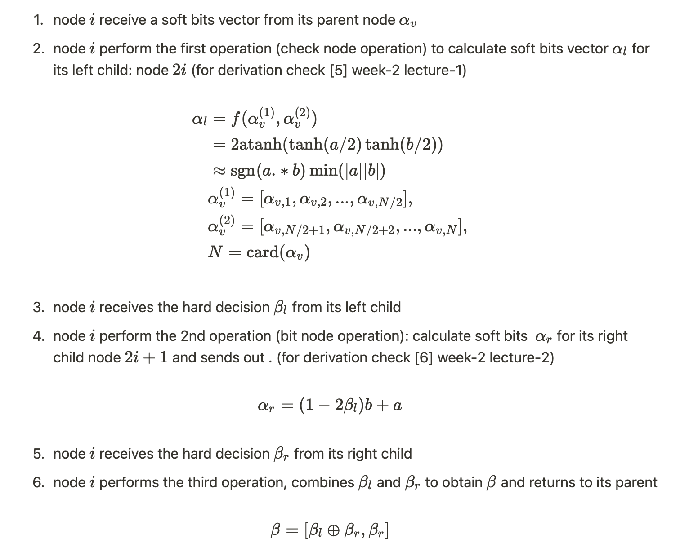
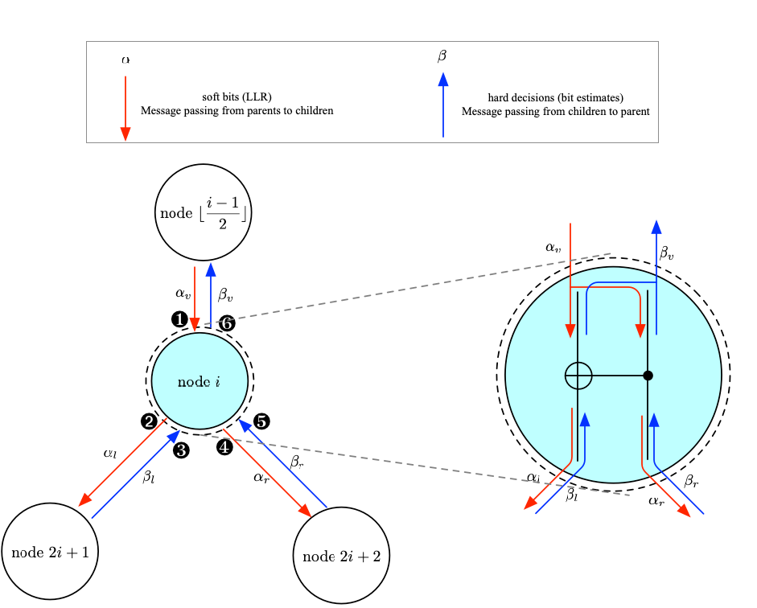

# Polar-Code-CPP
Polar Code C++ Implementation

try out *`example_run.m`  which shows how to use the implemented polar codes.*

## Features

C++ 17 needed to run the examples and use the code.  No additional package is used, only standard library.

The functions are encapsulated in a class for easy use.

### code construction ：

- channel polarization using Huawei approximation [3]

### Encoding

- 3GPP encoding (without bit-reversal permutation)  $\mathbf x = \mathbf u \mathbf F_n$

### Decoding

- SC decoder
- CRC-aided SC decoder

### Rate matching and rate recovery

- to support different codeword length and code rate

### Member Variables (Properties)

```cpp
//member variables
	unsigned m_N; // mother codeword length
	unsigned m_M; // codeword length
	unsigned m_K; // infomation length
	std::vector<unsigned> m_F;		// frozen bit positions (including puncture postions)
	std::vector<unsigned> m_P;		// puncture pattern
	std::vector<unsigned> m_I;		// information bit positions
	std::vector<unsigned> m_Q;		// reliabilty sequence
```

### Public member functions

```cpp
//public member functions
	//constructor
	POLAR(uint32_t info_length,
		uint32_t code_length,
		const std::string constuct_method = "Huawei Approx",
		const double design_para = 0);
	//encoder
	std::vector<bool> encoder(std::vector<bool>* msg);
	//SC decoder
	std::vector<bool> sc_decoder(std::vector<double>* llr);
	//SCL decoder
	std::vector<bool> scl_decoder(std::vector<double>* llr, std::vector<bool> crc_g, unsigned nL);
	//rate matching
	std::vector<bool> rate_matching(std::vector<bool>* in);
	//rate recovery
	std::vector<double> rate_recovery(std::vector<double>* in);
```

### Core functions implementation explanation

### **Encoding**


With the above equation, the encoding functioncan be implemented recursively as 


### SC decoding :

For each non-leaf node, it receives a soft bits vector from its parents and send the corresponding  hard decision vector  back to its parent. It involves 6 messages and 3 operations in the following sequence (  Refer to the following diagram)







For each leaf node:

- if it corresponds to a frozen bit, the hard decision will always be 0
- if it corresponds to a information bit, the hard decision is made by simple threshold detection, soft bits > =0, hard decision = 0,  soft bits < 0, hard decision = 1

### SCL decoding

Run L SC decoders in parallel,  all operations for non-leaf node are the same. when reaching a leaf node, for information bit, instead of make threshold detection, it generates two candidates: the candidate agrees with threshold detection and the candidate opposes threshold detection.  A penalty is put on the oppose candidate. so that L decoders, becomes 2L candidates. Then a sort and prune procedure is performed based on path metrics to select L candidates with least path metrics.

The idea is simple, but when it comes to the implementation, it involves a big complexity in terms of the time and memory. As the information(soft bits, hard decisions, PM) of each node for each SC encoder need  to be stored/ exchanged /compared when needed. It involves a 3D matrix to store these information:  the first dimension is for list of SC decoders, the second dimension is for nodes in the binary tree representation, the third dimension is for soft bits/hard bits. [6]

This implementation optimizes the process, in stead of store all information of each node for all SC encoders in a 3D matrix like [5], all nodes have a shared storage of soft bits which changes (push in and pop out ) accordingly to ensure only necessary soft bits staying in the storage. This reduced time/memory complexity  dramatically. 

### Reference

[1] E. Arikan, “Channel polarization: A method for constructing capacityachieving codes for symmetric binary-input memoryless channels,” CoRR, vol. abs/0807.3917, 2008.

[2]H. Ochiai, P. Mitran and H. Vincent Poor, "Capacity-Approaching Polar Codes With Long Codewords and Successive Cancellation Decoding Based on Improved Gaussian Approximation," in IEEE Transactions on Communications, vol. 69, no. 1, pp. 31-43, Jan. 2021, doi: 10.1109/TCOMM.2020.3030057.

[3] 3GPP R1-167209. Polar code design and rate matching

[4] Pfister, Henry D. "A brief introduction to Polar codes." Supplemental Material for Advanced Channel Coding (2014).

[5] Ochiai, Hideki, Patrick Mitran, and H. Vincent Poor. "Capacity-Approaching Polar Codes with Long Codewords and Successive Cancellation Decoding Based on Improved Gaussian Approximation." IEEE Transactions on Communications 69.1 (2020): 31-43.

[6] [https://nptel.ac.in/courses/108/106/108106137/](https://nptel.ac.in/courses/108/106/108106137/)
